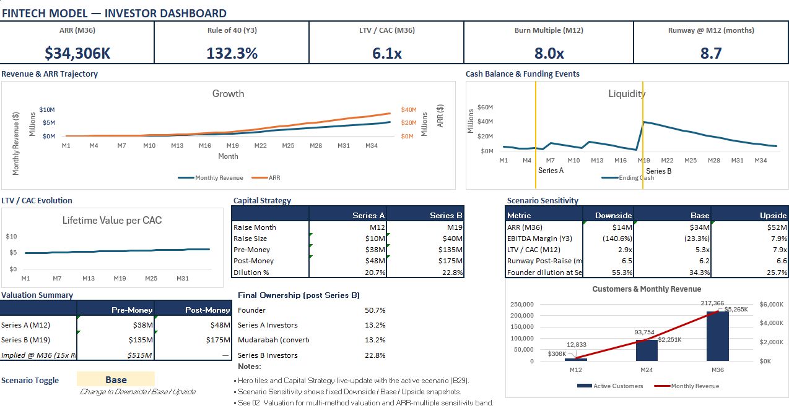

# **Strategic Finance Operating Model, High-Growth Fintech (36-Month Simulation)**

## **Project Overview**

A fully integrated 36-month operating model built to simulate capital planning and strategic finance decision-making for a high-growth multi-product fintech.

The model links operating drivers like acquisition spend, CAC efficiency, churn, GMV throughput and lending penetration to a complete three-statement output, a Shariah-compliant bridge and a two-round institutional funding strategy, and ownership dilution through Series A and Series B.

**Revenue streams modelled:**
- Payments (GMV times take rate, net of processing costs and chargebacks)
- Card interchange and subscription monetisation
- Lending (origination fees and interest income on the outstanding loan book)

**The strategic question the model answers:** How much capital does this business need, when, and what does the founder give up to get there?

---

## **Model Architecture**

### Time Horizon
36-month monthly model

### Financial Statements
- Integrated Income Statement (with NOL tracking and UAE corporate tax)
- Cash Flow Statement
- Balance Sheet (fully balanced every period)

### Operating Engines
- Customer acquisition: budget divided by CAC (not fixed MoM growth, as spend is the binding constraint)
- CAC with MoM efficiency improvement and asymptotic floor
- Retention and monthly churn with reactivation
- Active customer rate (transacting vs total base)
- Marketing budget in three tiers: Pre-Series A / Post-Series A / Post-Series B
- Lending penetration with scenario-based activation (Month 9)
- Working capital module: AR days, AP days, payroll accrual, deferred revenue
- Dynamic per-function hiring plan (Engineering, Data, Sales, CX, G&A, monthly net hires)
- Capitalized software CapEx derived from Engineering and Data payroll (IFRS/GAAP development cost treatment)

### Capital Structure

| Instrument | Amount | Timing | Type |
|-----------|--------|--------|------|
| Seed equity | $6.5M | M1 | Equity |
| Venture debt | $4M | M4 to M5 ($3M) plus M7 ($1M) | Debt (10% annual) |
| Mudarabah bridge | $8M | M7 | Shariah-compliant; no interest; converts M12 at 20% discount |
| Series A | $10M | M12 | Equity; 15 times M12 ARR plus cash; 17.1% dilution |
| Series B | $40M | M19 | Equity; 15 times M19 ARR plus cash; 22.8% dilution |
| **Total** | **$68.5M** | | |

The Mudarabah bridge is structured as a Shariah-compliant profit-sharing instrument, consistent with UAE Islamic finance norms and accessible to Gulf family offices and Islamic institutional investors that cannot hold interest-bearing instruments. It converts to equity at Month 12 alongside the Series A at a 20% discount to the Series A price.

**Post-Series B ownership:** Founder ~50.7% / Series A ~13.2% / Mudarabah ~13.2% / Series B 22.8%

### Valuation
- Primary method: ARR multiple (15 times base, Finro 2025 global Series A median; sensitivity band 10 to 20 times)
- Cross-check: Revenue multiple (5 times)
- Cross-check: 5-year DCF (25% WACC, 3% terminal growth, 15% Y5 FCF margin, supplementary only; terminal value dominates at burn stage)
- Full ownership waterfall: Founder to Mudarabah to Series A to Series B

### Scenario Framework
- Downside / Base / Upside
- **10 scenario levers:** Marketing budget, churn, CAC, take rate, AR days, AP days, GMV per active, chargeback rate, lending penetration, monthly yield
- **Regulatory stress scenarios** (self-contained analytical blocks in 21_Scenarios):
  - Take rate compression: 1.2% to 1.0% at Month 18 (CBUAE interchange trajectory)
  - Lending yield, regulatory convergence: 1.1% per month to 0.917% per month at Month 18 (11% p.a.)
  - Lending yield, full rate cap: 1.1% per month to 0.75% per month at Month 24 (9% p.a., bank rate parity)
- Funding plan held constant across scenarios (management commitment, not a market variable)
- Capital sensitivity: raise month vs raise size (minimum runway, first negative cash, runway post-raise)

### KPI Layer
Investor-grade metrics tracked monthly and at Y1/Y2/Y3 end:

| Metric | Description |
|---|---|
| ARR / Run-Rate Revenue | Subscription ARR (pure SaaS) vs full recurring base |
| LTV / CAC | Unit economics health; greater than 3 times is the VC convention |
| CAC Payback | Months to recover acquisition cost; under 12 months is the benchmark |
| Burn Multiple | Net burn divided by change in Run-Rate Revenue; under 1 is efficient, 1 to 2 is healthy |
| Gross Profit Margin | Revenue net of variable COGS (processing, chargebacks, support) |
| EBITDA Margin | Operating profitability before D&A, interest, tax |
| Rule of 40 | Year-on-year revenue growth % plus EBITDA margin %; above 40% is best-in-class |
| NRR Proxy | Gross retention floor = (1 − monthly churn)^12 |
| Magic Number | Change in Run-Rate Revenue divided by marketing spend; above 0.75 is efficient |
| Operating Leverage | Change in EBITDA divided by change in Revenue; shows whether growth flows to profit |
| Contribution Margin / Active | GP minus variable support and marketing, divided by active customers |
| D/E Ratio | Displays n/m when equity is non-positive |
| Loan Book | Outstanding lending balance from balance sheet |
| Runway | Months of cash at current burn; caps at 999 when burn is zero or below |

---

## **Base Case Results**

| Metric | Value |
|---|---|
| Revenue (Y3) | $46.4M |
| EBITDA Margin (Y3) | −23.3% |
| Gross Margin | 81% |
| M12 ARR | $1.97M |
| M19 ARR | $6.65M |
| Minimum cash (M12 to M18) | $1.49M at M18 |
| Founder ownership post-Series B | ~50.7% |

### Capital Strategy

| Round | Month | Amount | Pre-Money | Post-Money | Dilution |
|---|---|---|---|---|---|
| Mudarabah bridge | 7 | $8M | N/A | N/A | Converts M12 (17.1%) |
| Series A | 12 | $10M | $38.4M | $48.4M | 17.1% |
| Series B | 19 | $40M | $135.5M | $175.5M | 22.8% |

---

## **Key Strategic Insights**

- **Shariah-compliant capital structure from inception.** The Mudarabah bridge is not a workaround, it is a deliberate positioning choice. It opens the investor pool to Gulf family offices, Islamic VCs (Gulf Islamic Investments, Arzan Capital, ADIB Ventures), and sovereign fund Islamic tranches that cannot hold interest-bearing instruments. Tamara's $2.4B Shariah-compliant facility in 2025 validates this approach at scale.
- **Capital intensity is structural, not behavioural.** Even in the upside case, the business requires seed, bridge, Series A, and Series B to reach scale. The bridge covers the M7 to M11 cash gap while waiting for Series A traction to materialise at Month 12.
- **Unit economics improve with scale.** LTV/CAC and gross margin (81%) improve as the lending product scales from M9; multi-product mix drives faster margin convergence than single-product interchange models (Nubank/Kaspi playbook).
- **Founder majority preserved through Series B.** The 15 times ARR multiple at Series A and a right-sized $10M raise result in approximately 50.7% founder ownership post-Series B; founders retain control through both institutional rounds.
- **Lending is the third leg, activating M9.** It scales asset-light and provides margin uplift without diluting unit economics. The model's EBITDA trajectory from −23.3% in Y3 is driven by lending margin improving the blended revenue mix.
- **Take rate is the highest-impact risk.** The 1.2% base sits at the CBUAE regulatory ceiling (Notice 1998/2024). A compression scenario, 1.2% to 1.0% at Month 18, is modeled in 21_Scenarios. Investors should focus on this assumption above all others.

---

## **Scenario Stress (Y3)**

| Metric | Downside | Base | Upside |
|---|---|---|---|
| Revenue (Y3) | ~$18.8M | $46.4M | ~$81.9M |
| EBITDA Margin (Y3) | ~−125% | −23.3% | ~+14% |
| Take rate compression (M18 step-down) | Self-contained scenario in 21_Scenarios | 1.2% flat | N/A |
| Lending yield, regulatory convergence | −$31,649 Y3 delta | 1.1% per month flat | N/A |
| Lending yield, full rate cap | −$60,532 Y3 delta | 1.1% per month flat | N/A |

---

## **Market Validation & Risk Register**

This model has been independently validated against MENA fintech comparables, regional funding patterns, and the UAE regulatory environment. See docs/Market_Validation_Report.md for:
- Comparable company analysis (Ziina, Tabby, Tamara, NymCard, Flow48)
- Series A and B benchmarks against the MENA median
- Take rate regulatory ceiling (CBUAE Oct 2024)
- Lending yield regulatory trajectory
- Risk register and mitigation paths

**Key validation findings:** Unit economics are defensible; regulatory risk on take rate is the highest-impact assumption.

---

## **File Structure**

### Executive Layer
- 00_Executive_Summary, narrative overview with live-linked headline metrics
- 01_Dashboard, investor dashboard: ARR trajectory, cash and funding events, LTV/CAC evolution, capital strategy, scenario sensitivity, customer and revenue mix
- 02_Valuation, multi-method valuation: ARR multiple (primary), revenue multiple (cross-check), DCF (cross-check), ARR sensitivity band, full ownership waterfall
- 03_KPIs, full monthly KPI engine with Y1/Y2/Y3 snapshots

### Financial Statements
- 10_Income_Statement, P&L with NOL opening/used/ending balance and UAE tax logic
- 11_Cash_Flow, indirect method cash flow from operations, investing, financing
- 12_Balance_Sheet, full balance sheet with balance check row (zero every period)

### Strategic & Sensitivity
- 20_Capital_Sensitivity, cap table optimization tool testing Series A raise month (M9, M12, M15, M18) against raise amount ($5M to $15M). Output grids: Series A dilution %, founder ownership post-Series A, minimum cash floor to Series B (M19). Config block shows current model waterfall figures (17.1% Series A dilution, 65.7% founder post-M12).
- 21_Scenarios, 10 scenario multipliers for Downside / Base / Upside (Rule of 40: 40% / 132% / 160.7%), plus three self-contained regulatory stress blocks: take rate compression (1.2% to 1.0% at M18), lending yield regulatory convergence (1.1% to 0.917%/month at M18), and lending yield full rate cap (1.1% to 0.75%/month at M24). Stress blocks do not affect base case outputs.
- 22_Scenario_Compare, side-by-side scenario comparison with live column (snapshot methodology documented in-sheet)
- 23_Time, month index and Year/Quarter labels

### Assumptions & Rationale
- 30_Assumptions_Rationale, full live-linked methodology documentation: every assumption, its rationale, source cell, and risk narrative (CAC channel mix risk; subscription attach cohort risk; take rate regulatory ceiling; lending yield regulatory trajectory)
- 38_Inputs_Valuation, ARR multiple, revenue multiple, WACC, terminal growth, DCF Y4/Y5 growth assumptions

### Inputs
- 31_Inputs_UnitEconomics, payments, card, lending, and platform serving cost assumptions
- 32_Inputs_GrowthRetention, acquisition, retention, CAC, and marketing budget inputs
- 33_Inputs_Opex_Headcount, starting headcount, per-function salaries, monthly hiring plan, dynamic payroll mix
- 34_Inputs_Opex_NonPeople, cloud and SaaS, rent, legal, G&A, R&D non-people fixed costs
- 35_Inputs_Capex_WC, capitalized software percent, other CapEx, depreciation life, AR/AP days, subscription prepay
- 36_Inputs_Funding, starting cash, venture debt schedule, Mudarabah bridge, equity rounds (month and amount). Note: Mudarabah conversion month (B11) must equal Series A month; see the in-cell warning before editing.
- 37_Inputs_Tax, UAE corporate tax rate, NOL utilisation cap

### Calculation Engines
- 40_Customers_Orders, customer acquisition, churn, reactivation, active rate
- 41_Revenue_COGS, revenue by stream (payments, interchange, subscription, lending) and COGS
- 42_OPEX, payroll (dynamic), variable support, fixed non-people, marketing
- 43_CAPEX_Depreciation, capitalized software, other CapEx, straight-line depreciation, net PP&E
- 44_Working_Capital, loan book, AR, AP, deferred revenue, payroll accrual
- 45_Funding_Interest_Equity, debt draws, interest expense (average-balance convention), Mudarabah bridge injection, equity injections

### Version History
- 90_Version_Log, change history from v1.0 to v2.9 (current)

---

## **How to Use**

1. Change the Scenario toggle on 01_Dashboard (cell B29) to Downside / Base / Upside.
2. Adjust raise timing or size in 36_Inputs_Funding. Do not change the Mudarabah conversion month (B11) without also re-linking the 02_Valuation waterfall; see the in-cell warning.
3. Review impact on runway, dilution, net debt, burn multiple on the Dashboard and 22_Scenario_Compare.
4. To flex unit economics assumptions, edit 31_Inputs_UnitEconomics and 32_Inputs_GrowthRetention.
5. To run a what-if on hiring, edit the per-function monthly net hires grid on 33_Inputs_Opex_Headcount.
6. To view regulatory stress scenarios (take rate compression, lending yield), navigate to 21_Scenarios; blocks are self-contained and do not affect base case outputs.
7. All assumptions are documented with rationale in 30_Assumptions_Rationale; start there if anything is unclear.

---

## **Limitations**

- Synthetic operating assumptions, not built for a specific live company
- Working capital timing is simplified (no seasonality, no invoice-level AR ageing)
- Single-tier subscription pricing (no freemium, no upsell expansion modelled)
- Regulatory stress scenarios in 21_Scenarios are self-contained analytical blocks; they do not feed back into the base case P&L or cash flow

---

*Model designed to demonstrate structured financial thinking, capital planning rigour, and investor-grade reporting across a multi-product fintech with a Shariah-compliant bridge and a two-round institutional funding strategy.*
